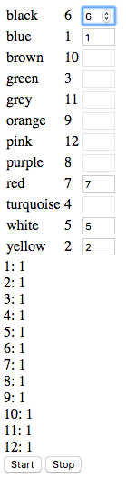

# A Numbers Puzzle

<blockquote class="twitter-tweet" data-lang="en">
Tricky little puzzle if you fancy it! Warning: Don’t go near it if you want to sleep any time soon 😝 <a href="https://t.co/8Tcif3ite0">https://t.co/8Tcif3ite0</a>
&mdash; Rachel Riley (@RachelRileyRR) <a href="https://twitter.com/RachelRileyRR/status/1049054928419938304?ref_src=twsrc%5Etfw">October 7, 2018</a></blockquote>

| Colour    | N  |
|-----------|----|
| Black     | 6  |
| Blue      | 1  |
| Brown     | 10 |
| Green     | 3  |
| Grey      | 11 |
| Orange    | 9  |
| Pink      | 12 |
| Purple    | 8  |
| Red       | 7  |
| Turqouise | 4  |
| White     | 5  |
| Yellow    | 2  |

